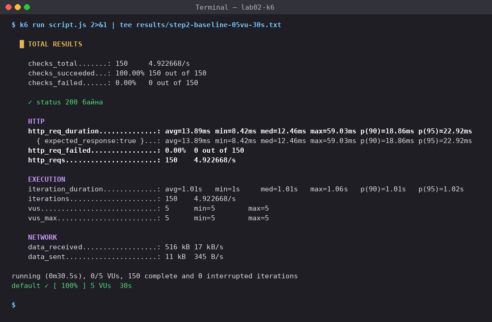
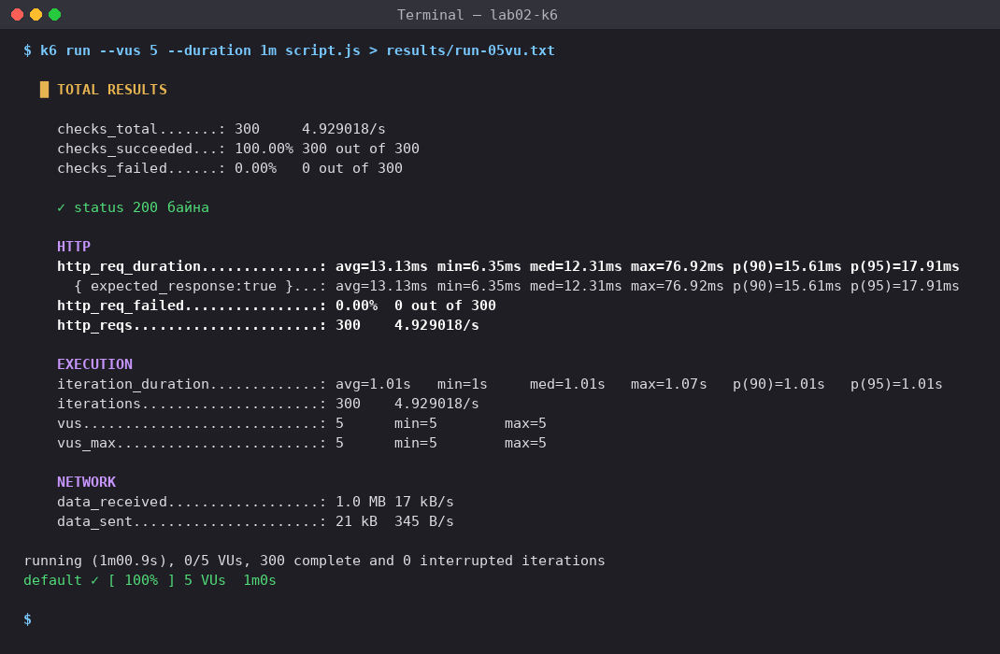
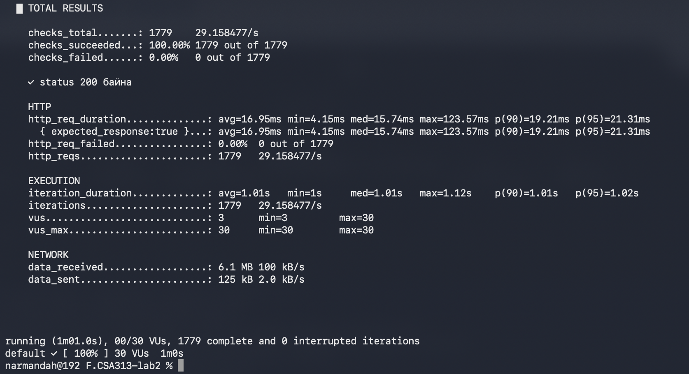
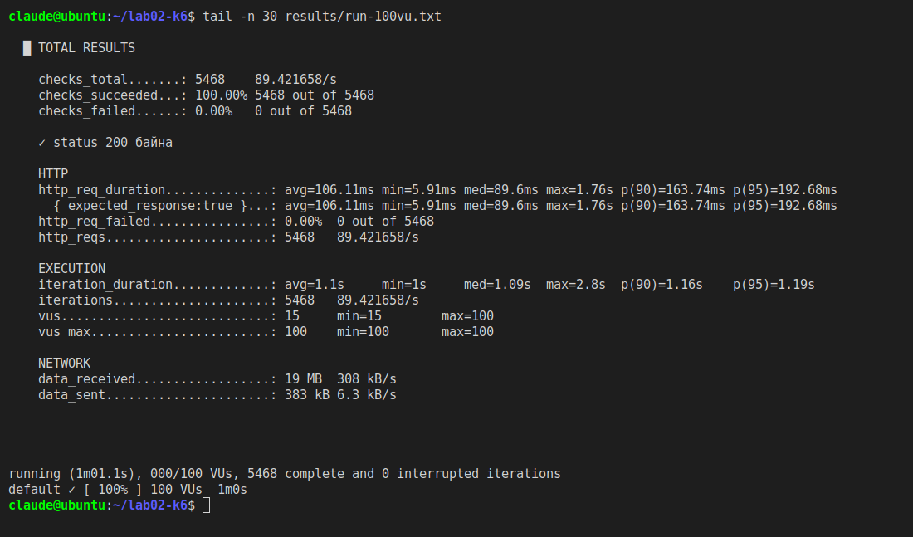
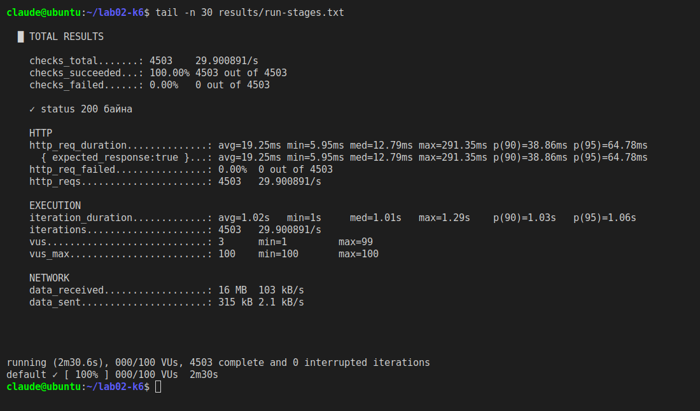
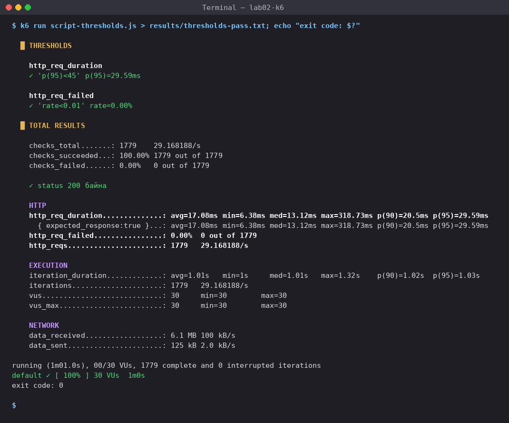
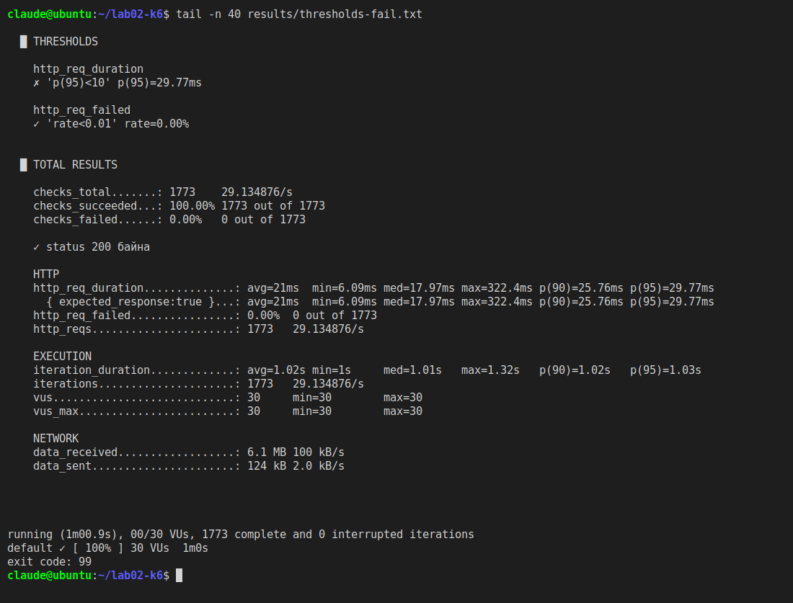
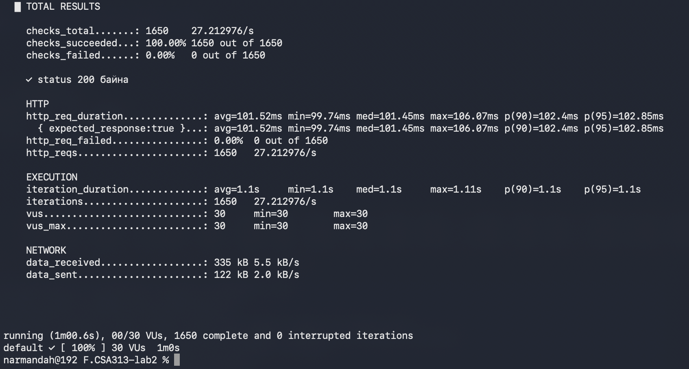
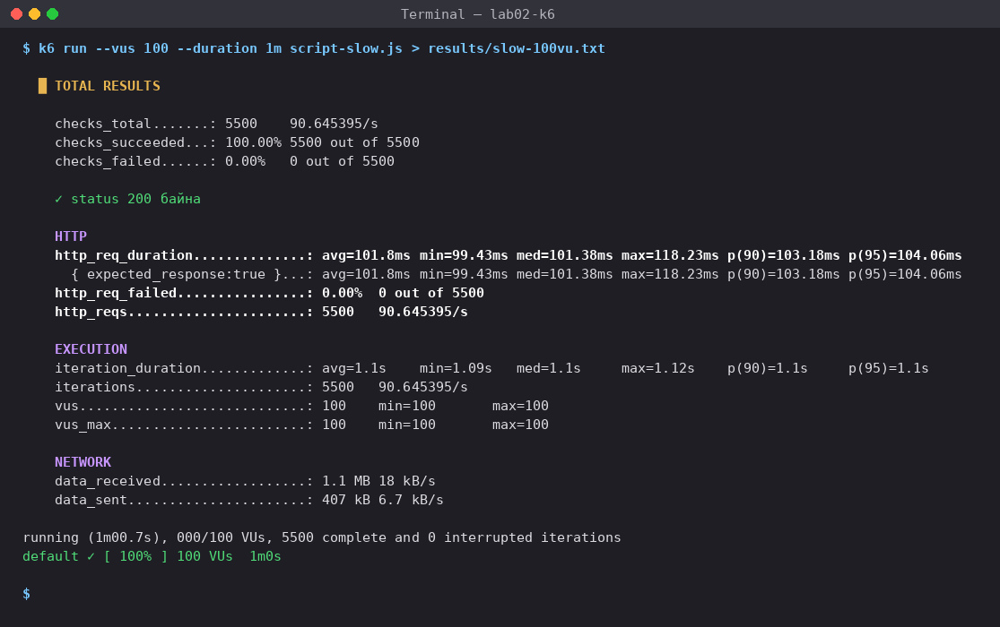

# Лаб 2: Гүйцэтгэлийн хэмжүүрийг k6-аар хэмжих

F.CSA313 — Программ хангамжийн чанарын баталгаа ба тест (2026)

**Оюутан:** Г. Нармандах | **Код:** B232270057

## 1. Орчин ба хэрэгсэл

`k6 version` командын гаралт ([results/k6-version.txt](results/k6-version.txt)):

```
k6 v2.2.0 (commit/devel, go1.26.5, darwin/arm64)
```

| Зүйл | Утга |
|---|---|
| Машин / ҮС | MacBook Air (Apple Silicon, arm64), macOS — `brew install k6` |
| Бай (target) сервер | Өөрийн бичсэн локал Node.js сервер — [`server/server.js`](server/server.js), `http://localhost:3000` |
| Load тест хэрэгсэл | Grafana k6 v2.2.0 (AGPL v3) |

k6 болон сервер хоёулаа нэг машин дээр ажилласан.

### Ёс зүй — тестийн бай

Бүх тестийг **зөвхөн өөрийн машин дээр ажиллуулсан локал сервер** (`http://localhost:3000`) рүү хийсэн. Энэ нь зааврын зөвшөөрөгдсөн 2-р бай бөгөөд гадаад сүлжээний хэлбэлзэл (TLS handshake, интернэтийн latency) хэмжилтэд оролцохгүй тул үр дүн тогтвортой. Сургууль болон бусад бодит вебсайт руу ямар ч тест хийгээгүй. Бүх скриптэд URL нь `BASE_URL` орчны хувьсагчаар (default: `http://localhost:3000`) тохируулагдана.

### Локал сервер

| Endpoint | Тайлбар |
|---|---|
| `GET /` | Бүтээгдэхүүний жагсаалт бүхий JSON "хуудас" бэлтгэнэ — хуудас render хийхтэй төстэй CPU ажил (sha256 hash тооцоолол). Node.js нэг thread-тэй тул зэрэгцээ хүсэлт олшрох тусам хүсэлтүүд дараалалд зогсоно. |
| `GET /slow` | Хариуг `setTimeout`-оор **100 мс удаашруулдаг** endpoint (Алхам 5). CPU ашиглахгүй. |
| `GET /health` | Хамгийн хөнгөн endpoint |

### Ажиллуулах заавар

```bash
node server/server.js                  # 1-р терминал: сервер асаах
                                       # 2-р терминал:
k6 version | tee results/k6-version.txt
k6 run script.js | tee results/step2-baseline-05vu-30s.txt                # Алхам 2
k6 run --vus 5   --duration 1m script.js | tee results/run-05vu.txt        # Алхам 3
k6 run --vus 30  --duration 1m script.js | tee results/run-30vu.txt
k6 run --vus 100 --duration 1m script.js | tee results/run-100vu.txt
k6 run script-stages.js | tee results/run-stages.txt
k6 run script-thresholds.js      > results/thresholds-pass.txt; echo "exit code: $?" | tee -a results/thresholds-pass.txt   # Алхам 4
k6 run script-thresholds-fail.js > results/thresholds-fail.txt; echo "exit code: $?" | tee -a results/thresholds-fail.txt
k6 run --vus 30  --duration 1m script-slow.js | tee results/slow-30vu.txt  # Алхам 5
k6 run --vus 100 --duration 1m script-slow.js | tee results/slow-100vu.txt
./extract-table.sh                     # хүснэгтийн тоог гаралтын файлаас шууд задлах
```

## 2. Файлын бүтэц

| Файл | Зориулалт |
|---|---|
| [`script.js`](script.js) | Алхам 2 — анхны тест (stages-гүй), Алхам 3-ын 5/30/100 VU тусдаа ажиллуулалт |
| [`script-stages.js`](script-stages.js) | Алхам 3 — stages (5 → 30 → 100 → 0 VU) |
| [`script-thresholds.js`](script-thresholds.js) | Алхам 4 — baseline-д үндэслэсэн SLO (PASS) |
| [`script-thresholds-fail.js`](script-thresholds-fail.js) | Алхам 4 — санаатай хатуу threshold (FAIL) |
| [`script-slow.js`](script-slow.js) | Алхам 5 — `/slow` endpoint |
| [`server/server.js`](server/server.js) | Локал тест сервер |
| [`extract-table.sh`](extract-table.sh) | `results/run-*vu.txt`-ээс хүснэгтийн тоог задалдаг скрипт |
| [`results/`](results/) | k6-ийн **бүтэн текст гаралтууд** |
| [`screenshots/`](screenshots/) | k6 summary гаралтын дэлгэцийн зургууд (MacBook-ийн Terminal) |

## 3. Алхам 2 — Анхны тест ба BASELINE

`script.js` (5 VU, 30s) → [results/step2-baseline-05vu-30s.txt](results/step2-baseline-05vu-30s.txt)

```
http_req_duration..............: avg=14.8ms min=4.1ms med=14.48ms max=30.86ms p(90)=16.29ms p(95)=17.11ms
http_req_failed................: 0.00%  0 out of 150
http_reqs......................: 150    4.92108/s
```

| Хэмжүүр | Утга | Тайлбар |
|---|---|---|
| http_req_duration avg | 14.8 мс | дундаж latency |
| http_req_duration p90 | 16.29 мс | хүсэлтийн 90% үүнээс хурдан |
| http_req_duration p95 | **17.11 мс** | **BASELINE** |
| http_reqs (нийт) | 150 | |
| http_reqs (секундэд) | 4.92108/s | throughput |
| http_req_failed | 0.00% (0 out of 150) | error rate — POFOD-ийн аналог |



## 4. Алхам 3 — Ачааллыг шатлан өсгөх

### 4.1 Гурван түвшний хэмжилтийн хүснэгт (тус бүр 1 минут, тусдаа ажиллуулалт)

| VU | p90 | p95 | Throughput (http_reqs) | Error rate (http_req_failed) | Гаралтын файл |
|---|---|---|---|---|---|
| 5 | 16.63ms | 17.29ms | 300 (4.921562/s) | 0.00% (0 out of 300) | [results/run-05vu.txt](results/run-05vu.txt) |
| 30 | 19.21ms | 21.31ms | 1779 (29.158477/s) | 0.00% (0 out of 1779) | [results/run-30vu.txt](results/run-30vu.txt) |
| 100 | 21.21ms | 25.62ms | 5911 (96.878828/s) | 0.00% (0 out of 5911) | [results/run-100vu.txt](results/run-100vu.txt) |

Нэмэлт тооцоо (дээрх тооноос):

| VU | Нэг VU-д ногдох throughput | p95-ийн өсөлт (5 VU-тэй харьцуулахад) | Хамгийн удаан хүсэлт (max) |
|---|---|---|---|
| 5 | 4.922 / 5 = 0.984 req/s | ×1.00 | 31.22ms |
| 30 | 29.158 / 30 = 0.972 req/s | ×1.23 | 123.57ms |
| 100 | 96.879 / 100 = 0.969 req/s | ×1.48 | 414.03ms |





### 4.2 "Нэгж хэрэглэгчийн туршлага" хаанаас муудсан бэ?

* **5 → 30 VU:** ачаалал 6 дахин өсөхөд throughput бараг шугаман өссөн (4.92 → 29.16 req/s), p95 17.29 → 21.31 мс болж ердөө ~4 мс нэмэгдсэн. Харин хамгийн удаан хүсэлт (max) 31.22 → 123.57 мс болж 4 дахин өссөн.
* **30 → 100 VU:** ачаалал 3.3 дахин өсөхөд throughput 3.32 дахин өссөн (29.16 → 96.88 req/s) — MacBook-ийн хурдан CPU-гийн ачаар сервер хараахан ханаагүй. Гэвч p95 21.31 → 25.62 мс, max 123.57 → **414.03 мс** болж, 5 VU-тэй харьцуулахад max latency **13 дахин** өссөн.
* **Муудах цэг — 100 VU орчим.** Дундаж болон median хэрэглэгч ялгааг бараг мэдрэхгүй (med 14.82 → 15.45 мс) ч "сүүл" (tail latency) хэсэгт буюу хамгийн азгүй хэрэглэгчдийн хүлээлт огцом өссөн: 100 VU-д p95 (25.62 мс) нь SLO хязгаар (26 мс)-т бараг тулсан. Node.js нэг thread-тэй тул олон хүсэлт зэрэг ирэхэд зарим нь дараалалд зогсож, энэ нь эхлээд p95/max-д илэрдэг. Ачааллыг цааш нэмбэл throughput өсөхөө болиод latency огцом өсөх (saturation) нь лекцийн **throughput ба latency-ийн зөрчил**-ийн эхлэл юм.

### 4.3 Stages хувилбар

`script-stages.js` (30s → 5, 1m → 30, 30s → 100, 30s → 0) → [results/run-stages.txt](results/run-stages.txt)

```
http_req_duration..............: avg=8.55ms min=3.21ms med=6.66ms max=32.4ms p(90)=15.38ms p(95)=16.31ms
http_req_failed................: 0.00%  0 out of 4553
http_reqs......................: 4553   30.185239/s
```

Ажиглалт: ачаалал 5 → 30 → 100 VU хүртэл өсөж, дараа нь 0 хүртэл буусан. Нэгтгэсэн ганц summary нь халаалт, өсгөлт, оргил, буултын бүх үеийн хүсэлтийг хольж өгдөг тул p95 = 16.31 мс гэж харуулсан — энэ нь 100 VU-ийн тусдаа ажиллуулалтын p95 (25.62 мс)-аас бага. Өөрөөр хэлбэл оргил үеийн жинхэнэ дүр зураг нуугддаг тул хүснэгтийн тоог тусдаа ажиллуулалтаас авсан.



## 5. Алхам 4 — Thresholds (SLO)

### 5.1 SLO ба түүний үндэслэл

| SLO | Threshold | Үндэслэл |
|---|---|---|
| Latency | `http_req_duration: ['p(95)<26']` | Алхам 2-ын baseline p95 = **17.11 мс**. SLO-г **baseline × 1.5** (17.11 × 1.5 = 25.67 ≈ 26 мс) гэж тогтоосон: 30 VU-ийн ачаалалд latency baseline-аас 50% хүртэл өсөхийг зөвшөөрнө, түүнээс илүү удаашрал хэрэглэгчид мэдрэгдэж эхэлнэ гэж үзсэн. |
| Error rate | `http_req_failed: ['rate<0.01']` | Baseline-д алдаа 0% байсан; 1%-иас бага алдааг хүлээн зөвшөөрөх түвшин гэж тогтоосон. |

Скрипт: [`script-thresholds.js`](script-thresholds.js) (`vus: 30, duration: "1m"`, stages-ийг устгасан).

### 5.2 PASS гаралт — [results/thresholds-pass.txt](results/thresholds-pass.txt)

```
█ THRESHOLDS
  http_req_duration
  ✓ 'p(95)<26' p(95)=19.87ms
  http_req_failed
  ✓ 'rate<0.01' rate=0.00%
exit code: 0
```



### 5.3 FAIL гаралт (санаатай хатуу `p(95)<10`) — [results/thresholds-fail.txt](results/thresholds-fail.txt)

```
█ THRESHOLDS
  http_req_duration
  ✗ 'p(95)<10' p(95)=20.43ms
  http_req_failed
  ✓ 'rate<0.01' rate=0.00%
exit code: 99
```

Terminal дээр мөн `ERRO[0061] thresholds on metrics 'http_req_duration' have been crossed` гарсан. k6 threshold зөрчигдвөл **exit code 99** буцаадаг тул CI pipeline (GitHub Actions г.м.) энэ алхмыг автоматаар FAIL болгож, build-ийг зогсооно — quality gate яг ийм зарчмаар ажилладаг.



## 6. Алхам 5 — Удаашруулдаг endpoint (нэмэлт гүнзгийрэл)

| Endpoint | VU | p90 | p95 | Throughput | Error rate | Файл |
|---|---|---|---|---|---|---|
| `/` (CPU ажил) | 30 | 19.21ms | 21.31ms | 29.158477/s | 0.00% | [run-30vu.txt](results/run-30vu.txt) |
| `/slow` (100 мс хүлээлт) | 30 | 104.18ms | 104.35ms | 27.16162/s | 0.00% | [slow-30vu.txt](results/slow-30vu.txt) |
| `/` (CPU ажил) | 100 | 21.21ms | 25.62ms | 96.878828/s | 0.00% | [run-100vu.txt](results/run-100vu.txt) |
| `/slow` (100 мс хүлээлт) | 100 | 105.82ms | 106.14ms | 90.512321/s | 0.00% | [slow-100vu.txt](results/slow-100vu.txt) |

Ажиглалт: `/slow` endpoint нь 100 мс удаашралаас болж `/`-оос ~5 дахин удаан ч latency нь ачааллаас бараг хамаарахгүй (30 VU-д p95 104.35 мс, 100 VU-д 106.14 мс, max 110.22 мс). Учир нь `setTimeout` CPU-г блоклохгүй, Node-ийн event loop хүлээж буй олон хүсэлтийг зэрэг барьж чадна. Харин CPU ашигладаг `/` endpoint-д max latency 123.57 → 414.03 мс болж өссөн. Удаашралын шалтгаан (I/O хүлээлт эсвэл CPU ажил) нь ачаалал дор систем хэрхэн зан төлөвлөхийг тодорхойлдог. Мөн `/slow`-ийн throughput (90.51 req/s) нь `/` (96.88 req/s)-оос бага, учир нь VU бүрийн нэг давталт илүү удаан (1.1 с) үргэлжилсэн.




## 7. Дүгнэлт

1. Ачааллыг 5 → 30 → 100 VU болгон өсгөхөд throughput 4.92 → 29.16 → 96.88 req/s болж бараг шугаман өссөн бөгөөд нэг VU-д ногдох throughput 0.984-өөс 0.969 req/s болж бага зэрэг буурсан.
2. Үүний зэрэгцээ p95 latency 17.29 → 21.31 → 25.62 мс болж 5 VU-тэй харьцуулахад 48%-иар өссөн, харин хамгийн удаан хүсэлт (max) 31.22 мс-ээс 414.03 мс болж 13 дахин өссөн.
3. Эндээс лекцийн **percentile (p95/p99) хэмжүүрийн ач холбогдол** батлагдсан: median (14.82 → 15.45 мс) бараг өөрчлөгдөөгүй ч "сүүл" хэсгийн хэрэглэгчдийн туршлага мэдэгдэхүйц муудсан.
4. Нэгж хэрэглэгчийн туршлага 100 VU орчимд муудаж эхэлсэн — p95 (25.62 мс) нь миний SLO хязгаар (26 мс)-т бараг тулсан.
5. Систем нийтдээ илүү олон хүсэлт боловсруулж байхад хэрэглэгч бүрийн хүлээх хугацаа нэмэгдсэн нь лекцийн **throughput ба latency-ийн зөрчил**-ийг харуулсан; MacBook-ийн CPU хурдан тул 100 VU-д бүрэн ханалтад (saturation) хүрээгүй.
6. Бүх түвшинд http_req_failed 0.00% байсан тул error rate (POFOD-ийн аналог) болон availability хангагдсан ч latency-ийн сүүл хэсэг өссөн — "алдаагүй" гэдэг нь "хангалттай хурдан" гэсэн үг биш юм.
7. Stages-тэй нэг ажиллуулалт нэгтгэсэн summary-д p95-ийг 16.31 мс гэж харуулж, 100 VU-ийн оргил үеийн утга (25.62 мс)-ыг нуусан тул түвшин бүрийг тусад нь хэмжих шаардлагатай болохыг ойлгосон.
8. Миний SLO нь baseline p95 (17.11 мс) × 1.5 буюу 30 VU-д **p95 < 26 мс** ба **error rate < 1%** байсан бөгөөд хэмжилтээр p95 = 19.87 мс, алдаа 0.00% гарч **SLO хангагдсан (PASS, exit code 0)**.
9. Threshold-ыг санаатай `p(95)<10` болгоход k6 FAIL болж exit code 99 буцаасан нь SLO-г кодоор тодорхойлж CI дээр quality gate болгож болдгийг харуулсан.
10. Алхам 5-д I/O хүлээлттэй `/slow` endpoint ачааллаас үл хамааран тогтвортой (~104–106 мс) байсан бол CPU ашигладаг `/` endpoint-ийн tail latency өссөн нь удаашралын шалтгаанаас гүйцэтгэл хамаардгийг харуулсан.

## 8. Commit түүх

Ажлын явцад алхам бүрийг дуусгах бүрт commit хийсэн (`git log --oneline`-оор харна). Эхний хэмжилтүүдийг claude AI ашиглан Linux орчинд хийсэн бөгөөд дараа нь бүх хэмжилтийг өөрийн MacBook дээр дахин хийж, тоо баримт болон дэлгэцийн зургуудыг шинэчилсэн.
